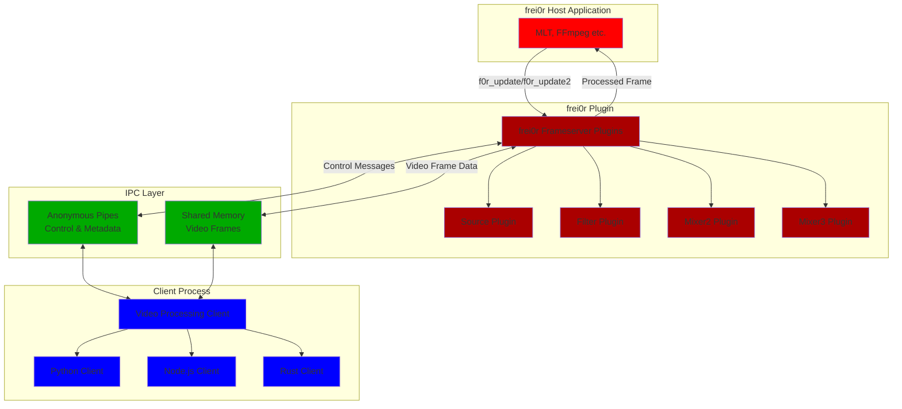

# MediaFX Frameserver

Implements "out of process" video effect plugins for [frei0r](https://dyne.org/software/frei0r/) -
enables video processing plugins to be written in Python, Node.js or Rust
running as external applications.

The frei0r plugins communicate with an external client process
using pipes and shared memory.
Source video frames are sent to the client which can apply visual effects
and return the modified frame.

